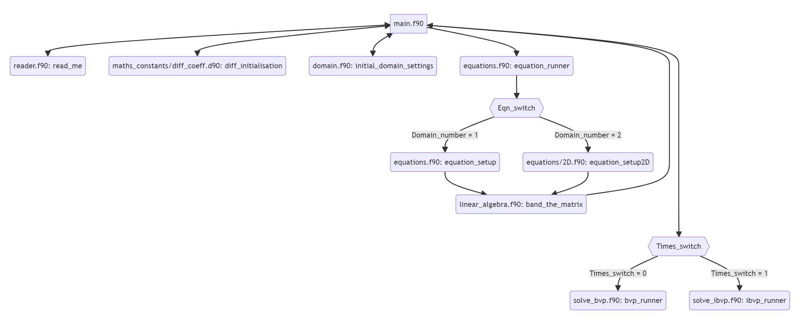

# 04. Modules and Code Structure

## File structure:

The structure of the repository `solver` is given by

```
├── README.md
├── .gitignore
├── fpm.toml
├── settings.input
├── app
│   └── main.f90
├── src
│   └── equations
│   │   └── 2D.f90
│   │   └── builder.f90
│   │   └── definitions.f90
│   │   └── definitions_test.f90
│   └── maths_constants
│   │   └── diff_coeff.f90
│   │   └── fundamental.f90
│   └── Newtons_method.f90
│   └── domain.f90
│   └── equations.f90
│   └── maths_constants.f90
│   └── linear_algebra.f90
│   └── reader.f90
│   └── solve_bvp.f90
│   └── solve_ibvp.f90
│   └── type_kinds.f90
├── test
│   └── check.f90
│   └── test_collection_BVP.f90
│   └── test_collection_lapack.f90
├── examples
├── build
└── LICENSE
```

* `.gitignore` tells `git` to ignore certain files
* `fpm.toml` sets the FPM and complier settings
* `settings.input` contains the solver settings and parameters
* The directory `app` contains the main parts of the program
* All remaining Fortran files are in the `src` directory
* It's important to note that the names of the modules inside `src/equations` are given by `equations_2D`, `equations_builder`, etc
* The directory `test` contains all the testing subroutines
* The directory `examples` contains all example equation files. Used in [Section 9](9.example_equations.md)
* The directory `test` contains all the module executables. This can be cleaned with the command `fpm clean`.

## General Overview:

Here is a general overview of the solver. Each node is it's own subroutine. 
The order of operations goes from left to right, up to down. 
If there is a double arrow then the new subroutine returns back to the original subroutine without calling any other significant subroutines.

We have not described every subroutine here - for example the subroutines `domain.f90: initial_domain_settings` and `equations.f90: equation_setup` 
will be described in [Section 7](07.non-uniform_domain.md).

Note that `main.f90` is in the directory `app`. All other `.f90` files are in the folder `src`.



