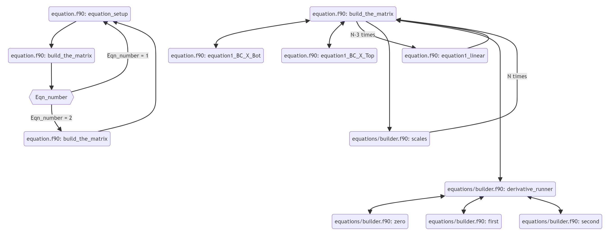

# 07. Non-Uniform Domain
  We then include the effect of multiplying the second derivative by a small parameter:

  $$\epsilon A(x) \frac{\partial^2 u}{\partial x^2}+B(x) \frac{\partial u}{\partial x}+C(x) u  = D(x)$$

The primary challenge in discretising this type of problem stems from the formation of a boundary layer near one of the domain's boundaries. This boundary layer presents a unique computational difficulty due to its dual nature. Outside this thin region, the equation's behavior approximates that of the case where $\epsilon = 0$. However, within the boundary layer itself, the influence of $\epsilon$ becomes significant and cannot be disregarded. This contrast in behavior between the two regions necessitates careful consideration of the discretization process. This is demonstrated in the second plot of example 1 in [Section 9](09.example_equations.md), where a uniform grid is used to discretise the problem and leads to the failure of the numerical solution to converge onto the analytical solution.

One method of overcoming such a problem is grid stretching. This technique involves clustering more points near the boundary where the boundary layer exists, allowing for a greater resolution in this region. The primary drawback of this approach is that the standard finite difference coefficients are invalid when used on non-uniform grids. While it is possible to derive new coefficients specifically for non-uniform grids, we instead elegantly map the physical domain onto a uniform computational grid. This transformation preserves the benefits of increased resolution near singularities while allowing the use of the standard finite difference coefficients.

We can establish a mapping between a non-uniform physical domain $x \in [x_l, x_r]$ and a uniform computational grid $c \in [0, 1]$. Given that $N$ represents the number of grid points, the mapping for $x$ is defined as follows: 

$$x_i = \frac{a  c(i)}{a+1-c_i} \quad (i = 1... N)$$

where 
  
  * $x_i$ represents the $i$-th point in the physical domain
  
  * $c_i = \frac{i-1}{N-1}$ for $i = 1, 2, ..., N$
  
  * $a = \frac{h}{1-2h},\quad h = \frac{x_0-x_l}{x_r-x_l}$
  
  * and $x_0$ is the clustering value that places half the points in between $x_l$ and $x_0$.

To convert the PDE from the $x$ domain to the $c$ domain we use the [chain rule](https://en.wikipedia.org/wiki/Chain_rule)

$$\frac{\partial u}{\partial x} = \frac{\partial u}{\partial c} \frac{\partial c}{\partial x}$$

$$ \frac{\partial^2 u}{\partial x^2} = \frac{\partial }{\partial x}\left(\frac{\partial u}{\partial c} \frac{\partial c}{\partial x}\right)=  \frac{\partial u^2}{\partial x\partial c} \frac{\partial c}{\partial x} + \frac{\partial u}{\partial c} \frac{\partial^2 c}{\partial x^2} =  \frac{\partial u^2}{\partial c^2} \left(\frac{\partial c}{\partial x}\right)^2 + \frac{\partial u}{\partial c} \frac{\partial^2 c}{\partial x^2} $$

We call the terms $\frac{\partial c}{\partial x}$ and $\frac{\partial^2 c}{\partial x^2}$ the metrics. We compute these numerically in subroutines `first_difference` and `second_difference` in `domain.f90`. 

Substituting these derivatives into the PDE results in the modified equation

$$A_c(c) \frac{\partial^2 u}{\partial c^2}+\left(B_c(c) + \right) \frac{\partial u}{\partial x}+C(c) u  = D(c)$$

where 

$$A_c = \epsilon A \left(\frac{\partial c}{\partial x}  \right)^2, \quad \text{and}\quad B_c = B\frac{\partial c}{\partial x} + \epsilon A \frac{\partial^2 c}{\partial x^2} $$

This is achieved by the subroutine `scales` in `equations/builder.f90`. 

We note that in `scales` we actually work in terms of $\frac{\partial x}{\partial c}$ and $\frac{\partial^2 x}{\partial c^2}$ as these quantities are easier to compute. From the chain rule:

$$ \frac{\partial c}{\partial x} = 1/\frac{\partial x}{\partial c} $$

$$ \frac{\partial^2 c}{\partial x^2} = -\frac{\partial^2 x}{\partial c^2} /(\frac{\partial x}{\partial c})^3 $$

## initial_domain_settings Overview:

All domain considerations are dealt in the module `domain.f90`. We emphasise that to construct a new domain all that needs to be specified in the subroutine `set_up_domain` in `domain.f90` are the domains boundaries, number of discretised points and the grid stretching settings. It is therefore easy to define multiple domains if needed.  

## equation_setup Overview:

All one-dimensional equations are built from the the modules `equations.f90` and `equations/builder.f90`.

