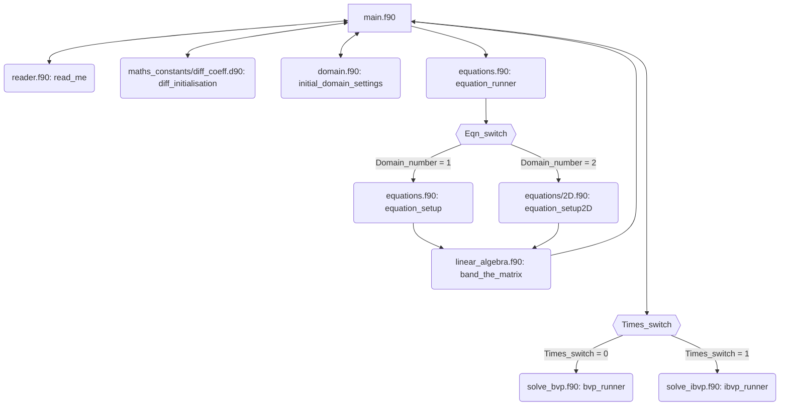
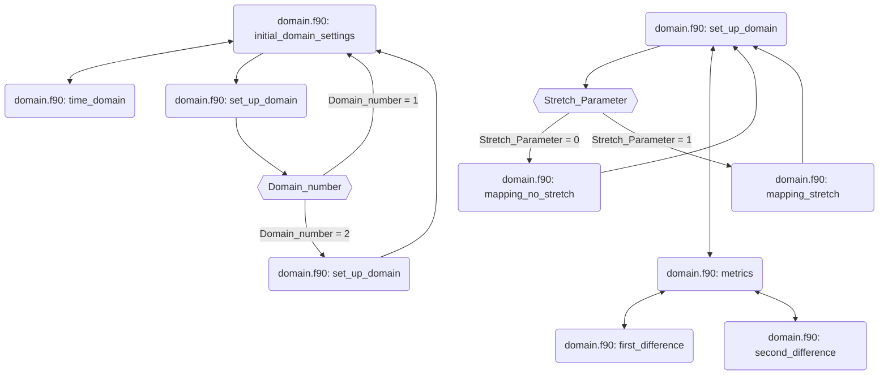
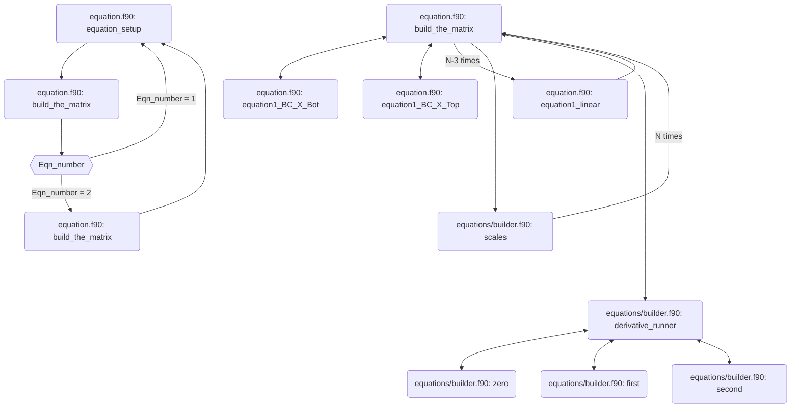

# General Overview Diagram

```mermaid
graph TD;
    main.f90 <--> id0(reader.f90: read_me);
    main.f90 <-->  id1(maths_constants/diff_coeff.d90: diff_initialisation)
    main.f90 <--> id2(domain.f90: initial_domain_settings)
    main.f90 --> id3(equations.f90: equation_runner)
    id3(equations.f90: equation_runner)  --> id4{{Domain_number}}
    id4{{Eqn_switch}} -->|Domain_number = 1| id5(equations.f90: equation_setup)
    id4{{Eqn_switch}}  --> |Domain_number = 2| id6(equations/2D.f90: equation_setup2D)
    id5(equations.f90: equation_setup) --> id7(linear_algebra.f90: band_the_matrix)
    id6(equations/2D.f90: equation_setup2D) --> id7(linear_algebra.f90: band_the_matrix)
    id7(linear_algebra.f90: band_the_matrix) --> main.f90
    main.f90 ------> id8{{Times_switch}}
    id8{{Times_switch}} -->|Times_switch = 0| id9(solve_bvp.f90: bvp_runner)
    id8{{Times_switch}}  --> |Times_switch = 1| id10(solve_ibvp.f90: ibvp_runner)
```

# Initial Domain Settings Diagram

```mermaid
graph TD;
    id0(domain.f90: initial_domain_settings) <--> id1(domain.f90: time_domain);
    id0(domain.f90: initial_domain_settings) --> id2(domain.f90: set_up_domain);
    id2(domain.f90: set_up_domain) --> id3{{Domain_number}}
    id3{{Domain_number}} --> |Domain_number = 1| id0(domain.f90: initial_domain_settings)
    id3{{Domain_number}} --> |Domain_number = 2| id4(domain.f90: set_up_domain)
    id4(domain.f90: set_up_domain) --> id0(domain.f90: initial_domain_settings)

    id5(domain.f90: set_up_domain) --> id6{{Stretch_Parameter}}
    id6{{Stretch_Parameter}} --> | Stretch_Parameter = 0 | id7(domain.f90: mapping_no_stretch)
    id6{{Stretch_Parameter}} --> | Stretch_Parameter = 1 | id8(domain.f90: mapping_stretch)
    id7(domain.f90: mapping_no_stretch) --> id5(domain.f90: set_up_domain)
    id8(domain.f90: mapping_stretch) --> id5(domain.f90: set_up_domain)
    id5(domain.f90: set_up_domain) <----> id9(domain.f90: metrics)
    id9(domain.f90: metrics) <--> id10(domain.f90: first_difference)
    id9(domain.f90: metrics) <--> id11(domain.f90: second_difference)
```

# Equation Setup Diagram

```mermaid
graph TD;
    id0(equation.f90: equation_setup) --> id1(equation.f90: build_the_matrix)
    id1(equation.f90: build_the_matrix) --> id2{{Eqn_number}}
    id2{{Eqn_number}} --> |Eqn_number = 1| id0(equation.f90: equation_setup)
    id2{{Eqn_number}} --> |Eqn_number = 2| id3(equation.f90: build_the_matrix)
    id3(equation.f90: build_the_matrix) --> id0(equation.f90: equation_setup) 

    id4(equation.f90: build_the_matrix) <--> id5(equation.f90: equation1_BC_X_Bot)
    id4(equation.f90: build_the_matrix) <--> id6(equation.f90: equation1_BC_X_Top)
    id4(equation.f90: build_the_matrix) --> |N-3 times| id7(equation.f90: equation1_linear)
    id7(equation.f90: equation1_linear) --> id4(equation.f90: build_the_matrix)
    id4(equation.f90: build_the_matrix) ----> id8(equations/builder.f90: scales)
    id8(equations/builder.f90: scales) ----> |N times| id4(equation.f90: build_the_matrix)
    id4(equation.f90: build_the_matrix) <------> id9(equations/builder.f90: derivative_runner)
    id9(equations/builder.f90: derivative_runner) <--> d11(equations/builder.f90: zero)
    id9(equations/builder.f90: derivative_runner) <--> d12(equations/builder.f90: first)
    id9(equations/builder.f90: derivative_runner) <--> d13(equations/builder.f90: second)
```