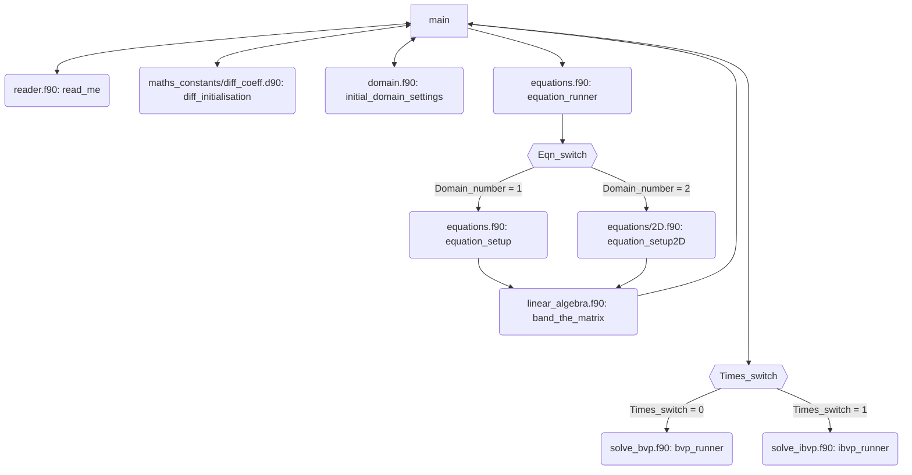
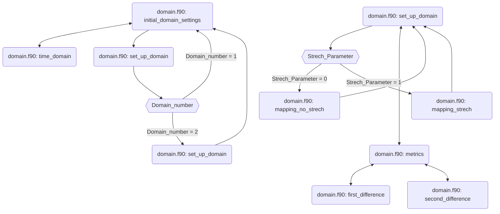

# 05. Modules and Code Structure

Here we give a general overview of the code. Other subroutines are called. 
The order of operations go from left to right, up to down. If there is a double arrow then the new subroutine back to the original subroutine straight away.

Note that `main.f90` is in the directory `app`. All other `.f90` files are in the folder `src`.
We have additionally listed subroutine names and the files they belong to.

## General Overview:

## initial_domain_settings Overview:

