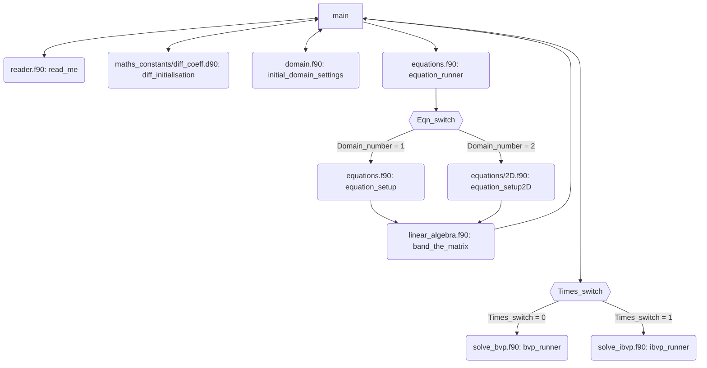

# 05. Modules and Code Structure

Here we give a general overview of the code. 
File structure:

The structure of the repository `solver` is given by

```
├── README.md
├── .gitignore
├── fpm.toml
├── settings.input
├── app
│   └── main.f90
├── src
│   └── equations
│   │   └── 2D.f90
│   │   └── builder.f90
│   │   └── definitions.f90
│   │   └── definitions_test.f90
│   └── maths_constants
│   │   └── diff_coeff.f90
│   │   └── fundamental.f90
│   └── Newtons_method.f90
│   └── domain.f90
│   └── equations.f90
│   └── maths_constants.f90
│   └── linear_algebra.f90
│   └── reader.f90
│   └── solve_bvp.f90
│   └── solve_ibvp.f90
│   └── type_kinds.f90
├── test
│   └── check.f90
│   └── test_collection_BVP.f90
│   └── test_collection_lapack.f90
└── LICENSE
```

## General Overview:

Here is a general overview of the code. Each node is it's own subroutine. 
The order of operations go from left to right, up to down. 
If there is a double arrow then the new subroutine back to the original subroutine straight away.
We have not described every subroutine here - the subroutines `domain.f90: initial_domain_settings` and `equations.f90: equation_setup` 
will be described in `08.non-uniform_domain.md`.

Note that `main.f90` is in the directory `app`. All other `.f90` files are in the folder `src`.
We have additionally listed subroutine names and the files they belong to.




