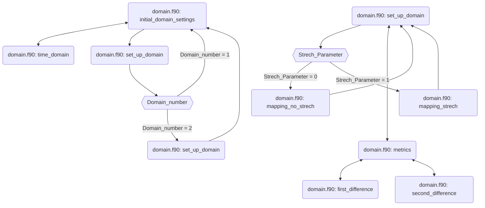
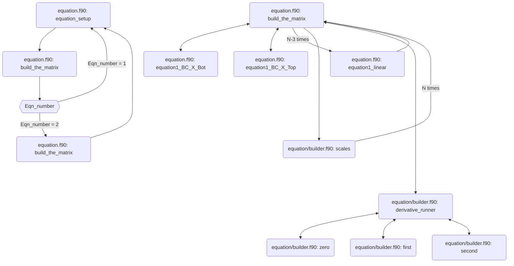

# 08. Non-uniform Domain
  We then the effect of multiplying the second derivative by a small parameter:
        $$\epsilon A(x) \frac{\partial^2 u}{\partial x^2}+B(x) \frac{\partial u}{\partial x}+C(x) u  = D(x).$$
One method of discretising such a problem is grid stretching, where more points are clustered near the boundary where the singularity exists. The downside of this approach is that standard finite difference coefficients are invalid for non-uniform grids. While we could derive the coefficients for a non-uniform grid, an alternative is to map the domain onto a uniform computational grid.

Therefore we have a non-uniform domain $x$ between $[x_l,x_r]$, and a uniform computational grid $c$ between $[0,1]$. If $N$ is the number of grid points, then the mapping for $x$ is given by 
$$x(i) = \frac{a  c(i)}{a+1-c(i)} \quad (i = 1... N)$$

where 

$$a = \frac{h}{1-2h},\quad h = \frac{x_0-x_l}{x_r-x_l}$$

and $x_0$ is the clustering value that places half the points inbetween $x_l$ and $x_0$.

To convert the PDE from the $x$ domain to the $c$ domain we use the [chain rule](https://en.wikipedia.org/wiki/Chain_rule)

$$\frac{\partial u}{\partial x} = \frac{\partial u}{\partial c} \frac{\partial c}{\partial x}$$

$$ \frac{\partial^2 u}{\partial x^2} = \frac{\partial }{\partial x}\left(\frac{\partial u}{\partial c} \frac{\partial c}{\partial x}\right)=  \frac{\partial u^2}{\partial x\partial c} \frac{\partial c}{\partial x} + \frac{\partial u}{\partial c} \frac{\partial^2 c}{\partial x^2} =  \frac{\partial u^2}{\partial c^2} \left(\frac{\partial c}{\partial x}\right)^2 + \frac{\partial u}{\partial c} \frac{\partial^2 c}{\partial x^2} $$

We call the terms $\frac{\partial c}{\partial x}$ and $\frac{\partial^2 c}{\partial x^2}$ the metrics. We compute these numerically in subroutines `first_difference` and `second_difference` in `domain.f90`. 

Substituting these derivatives into the PDE results in the modified equation

$$A_c(c) \frac{\partial^2 u}{\partial c^2}+\left(B_c(c) + \right) \frac{\partial u}{\partial x}+C(c) u  = D(c)$$

where 
$$A_c = \epsilon A \left(\frac{\partial c}{\partial x}\right)^2 $$
$$B_c = B\frac{\partial c}{\partial x} + \epsilon A \frac{\partial^2 c}{\partial x^2} $$

This is achieved by the subroutine `scales` in `equation/builder.f90`. 

## initial_domain_settings Overview:

This is all dealt in the module `domain.f90`. We emphasise that to construct a new domain all that needs to be specified in the subroutine `set_up_domain` in `domain.f90` are the domains boundaries, number of discretised points and the grid streching settings. It is therefore easy to define multiple domains if needed.  

## equation_setup Overview:

This is all dealt in the module `equations.f90` and `equations/builder.f90`.

